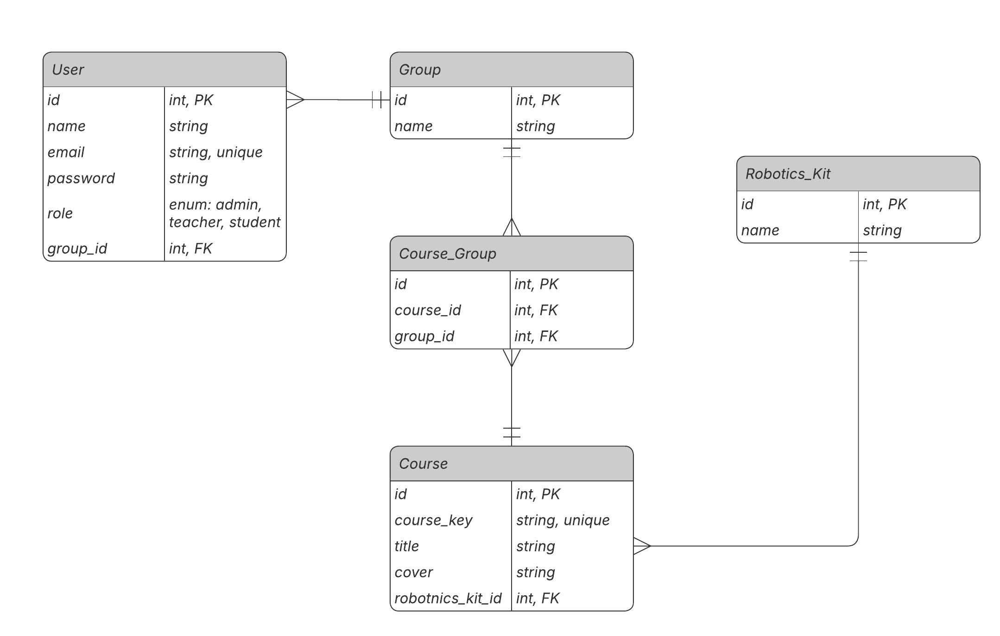

# Activity 7 and Homework 6

## Project Description
This system is designed for a small robotics school to manage their educational platform. The core objective of the platform is to assign students into designated groups and allocate specific robotics courses to those groups.

## ER Diagram
Below is the Entity-Relationship diagram illustrating the database architecture and the relationships between Users, Groups, Courses, and Robotics Kits.

